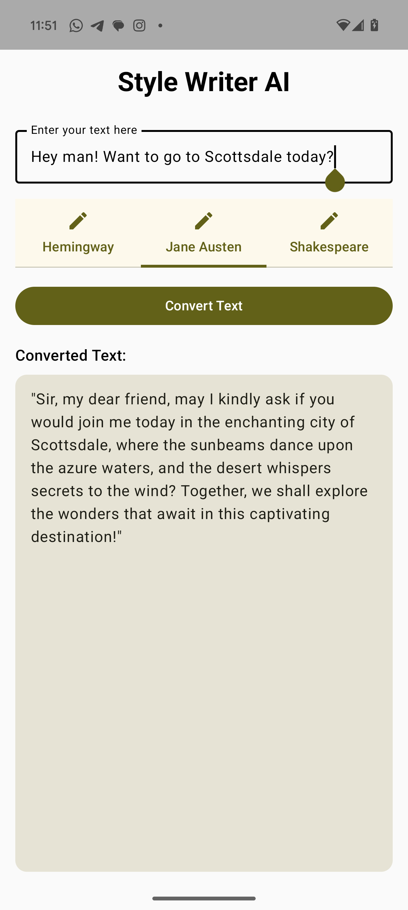

# Style Writer AI

Style Writer AI is an Android app that uses Gemini Nano running inference ON DEVICE (no internet required) to rewrite text in various styles. The app currently supports rewriting in the style of Ernest Hemingway, Jane Austen, and William Shakespeare, with a UI built using Jetpack Compose.

## Features

- **Rewrite Text in Different Styles**: Choose between different writing styles and watch as your input text is transformed.
- **Real-time Text Generation**: Input your text and watch Gemini Nano stream the output
- **User-Friendly UI**: Interface built with Jetpack Compose, featuring tabbed style selection and an easy-to-read output section.
- **Edge-to-Edge Display**: Optimized for modern Android devices with full-screen layout.

## Screenshots



## Installation

**warning!:** This app requires AICore beta with the Gemini Nano API, currently supported on on Pixel 9 series devices, Google Pixel 8 Series devices, Samsung S24 Series devices, Samsung Z Fold6, Samsung Z Flip6, Realme GT 6, Motorola Edge 50 Ultra, Motorola Razr 50 Ultra, Xiaomi 14T/Pro, and Xiaomi MIX Flip.

1. Clone the repository:
   ```bash
   git clone https://github.com/your-username/style-writer-ai.git
   ```

2. Open the project in Android Studio.
3. Build and run the app on an Android device or emulator.

## Usage

1. Input the text you want to rewrite in the main text field.
2. Select a writing style from the tabs.
3. Hit the "Convert Text" button to generate the rewritten text.
4. The output will be displayed in the text area below.

## Technologies Used

- **Kotlin**: For app development.
- **Jetpack Compose**: For building the user interface.
- **Gemini Nano API**: For real-time text generation.

## Future Enhancements

- Support for more writing styles.
- Custom style creation.
- LoRA adapters for more precise inference.